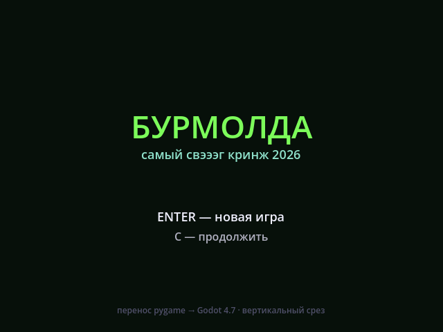
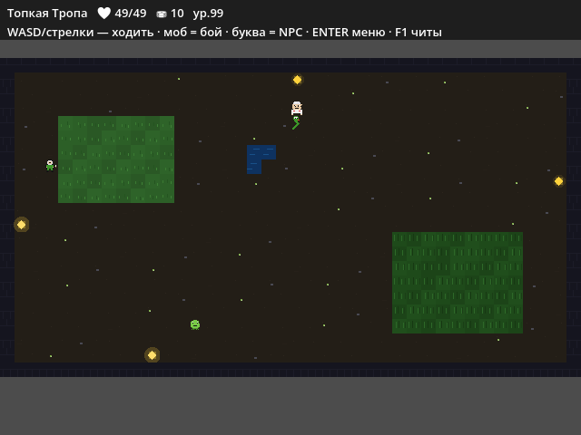
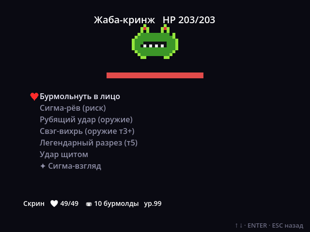
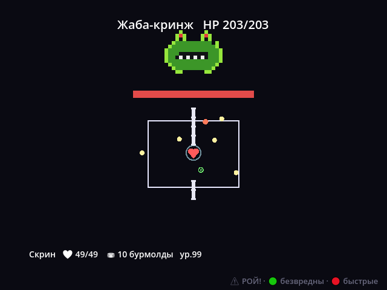
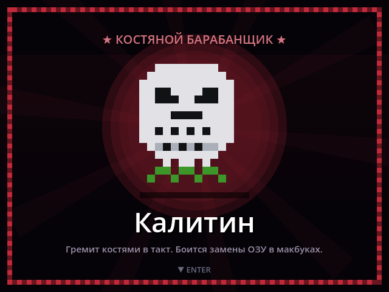
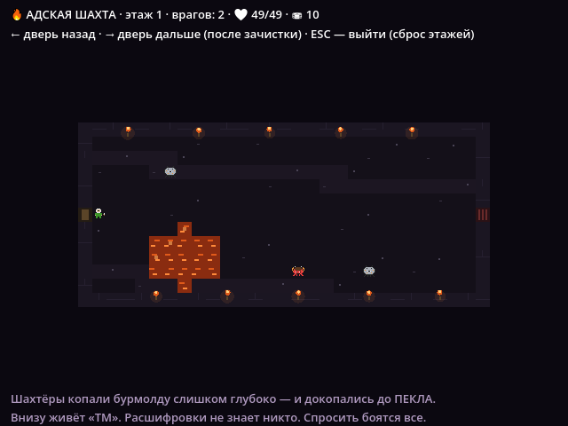

<div align="center">

# 🐸☣️ БУРМОЛДА

**Кринж/свэг RPG про ядовитое болото — перенос с pygame на Godot 4.7**


</div>

Undertale-style RPG: ходишь по клеточному надмиру, дерёшься в пошаговом бою
с фазой уворота (bullet-hell), качаешься, собираешь лут и разбираешься,
кто такой Калитин, дух Цизи и что вообще такое «ТМ» в Адской Шахте.

Все данные игры (предметы, локации, NPC, квесты, мобы, спрайты) лежат
**JSON-файлами** в `data/` — контент можно редактировать без единой строчки
кода. Вся логика — на GDScript, движко-специфичного мусора в правилах игры нет.

## Скриншоты

<table>
<tr>
<td></td>
<td></td>
</tr>
<tr>
<td></td>
<td></td>
</tr>
<tr>
<td></td>
<td></td>
</tr>
</table>

## Что уже есть

**🗺 Мир** — 35 хендкрафченных локаций в 17 биомах, видимые бродячие мобы
(войди — начнётся бой), гейт по уровню на сложные зоны, ноды добычи
(шахта/рыбалка/травы/кристаллы/эхо), НПС с диалогами-выборами и квестами,
пиксель-арт спрайты для всех персонажей и мобов.

**⚔️ Бой в стиле Undertale** — меню БОЙ/ДЕЙСТВИЕ/ПРЕДМЕТ/МИЛОСТЬ; набор
приёмов зависит от снаряги и того, чему тебя научили NPC; ход врага — фаза
уворота с **7 паттернами атак** (рой, ливень, стены костей с проходом,
вихрь, преследователи, лучи-телеграфы, шквал ветра), которые **комбинируются
и переключаются** внутри одной фазы. У боссов **фазы ярости** на 50% HP,
у каждого биома — своя физика уворота (лёд скользит, вулкан жжёт стены,
болото вязкое). Снаряды: цвет = скорость, часть — **безвредные обманки**.

**💍 Прогулка/лут** — 118 предметов (30 мечей, кольца-модификаторы с
эффектами вампиризм/мощь/крит/яд/мороз/шипы), экипировка на 6 слотов, кузнец,
трофеи и дроп с шансом, экономика ресурсов.

**🔥 Адская Шахта** — бесконечное подземелье: перебей всех → открывается
следующая комната, назад можно всегда, лут остаётся с тобой даже после
сброса. Лавовые реки (жгут рядом) и лавовые озёра с рыбами, которые
плюются медленными шарами. Мини-босс каждые 5 этажей, босс каждые 10,
и «ТМ» — каждые 25. Свой кринж-лор про Пекло, идущий фоном.

**🐸 Плюс** — чит-меню для дебага (F1: уровни, деньги, сеты, телепорт),
процедурный звук, автосохранение, автотесты.

## Быстрый старт (просто поиграть)

1. Скачай/склонируй репозиторий.
2. Дважды кликни **`Играть.bat`**.

При первом запуске скрипт сам скачает портативный Godot 4.7 (~80 МБ, движок
специально не хранится в репозитории — слишком тяжёлый бинарник) и запустит
игру. Дальше — открывает игру мгновенно.

**Управление:** стрелки/WASD — ходьба и меню (можно зажимать); Enter/Space —
выбрать/дальше/меню; Esc — назад/сохранить; F1 — чит-меню.

## Для разработчиков

Открыть проект в редакторе Godot вместо простого запуска:
`tools/godot/Godot_v4.7-stable_win64.exe` → Import → `project.godot` → F5.

Прогнать headless-тесты (без окна):
```
tools\godot\Godot_v4.7-stable_win64_console.exe --headless --path . -- --test
```

| Документ | Зачем |
|---|---|
| [РАЗРАБОТКА.md](РАЗРАБОТКА.md) | Полная архитектура: как устроены данные, ядро, сцены; известные грабли GDScript |
| [ИДЕИ.md](ИДЕИ.md) | Бэклог: что сделано, что предложено дальше (с оценкой сложности) |
| [КОММИТЫ.md](КОММИТЫ.md) | Как коммитить в этот репозиторий (co-author, формат сообщений, чек-лист) |

### Структура репозитория

```
data/            JSON-контент: предметы, локации, NPC, реплики, мобы, квесты, баланс
scripts/core/    движко-независимая логика: игрок, бой, предметы, квесты, лут, спрайты
scripts/scenes/  сцены: надмир, бой, диалог NPC, инвентарь, подземелье, кузнец…
scripts/ui/      переиспользуемые виджеты (меню в стиле Undertale)
scenes/          .tscn-файлы (тонкие: корневой узел + скрипт)
assets/          шрифты (эмодзи-фолбэк)
tools/seed.py    разовый генератор data/*.json из старого pygame-прототипа
tests/           headless-тесты логики
```

## Технологии

Godot 4.7 (GL Compatibility renderer), GDScript, JSON как формат контента.
Изначально прототипировано на Python/pygame, затем полностью перенесено —
подробности решения и карта портирования в [РАЗРАБОТКА.md](РАЗРАБОТКА.md).

## Авторы

Разработка: **[Arkorij](https://github.com/Arkorij)** и **[Tonics42](https://github.com/Tonics42)**.

## Лицензия

[MIT](LICENSE) — делай с кодом что хочешь, только сохрани копирайт.
